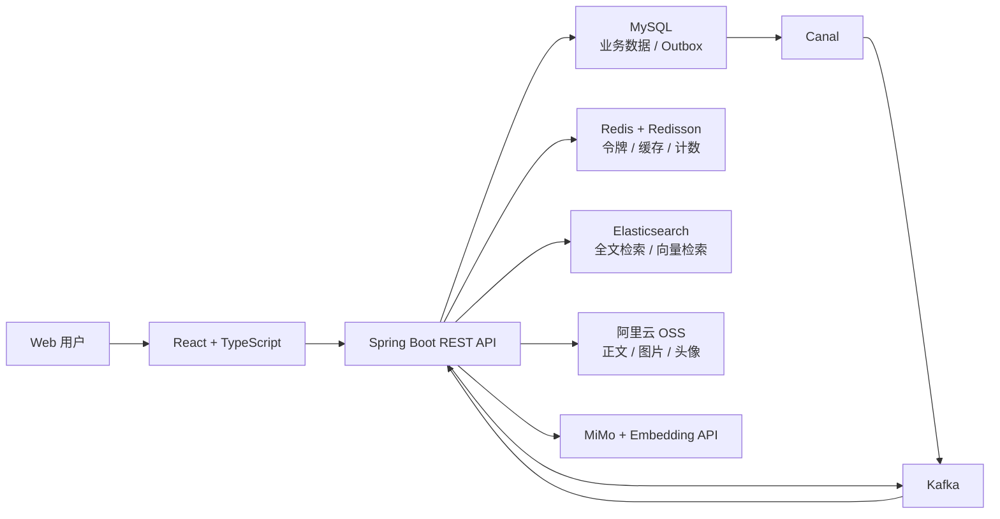
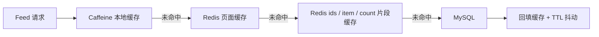
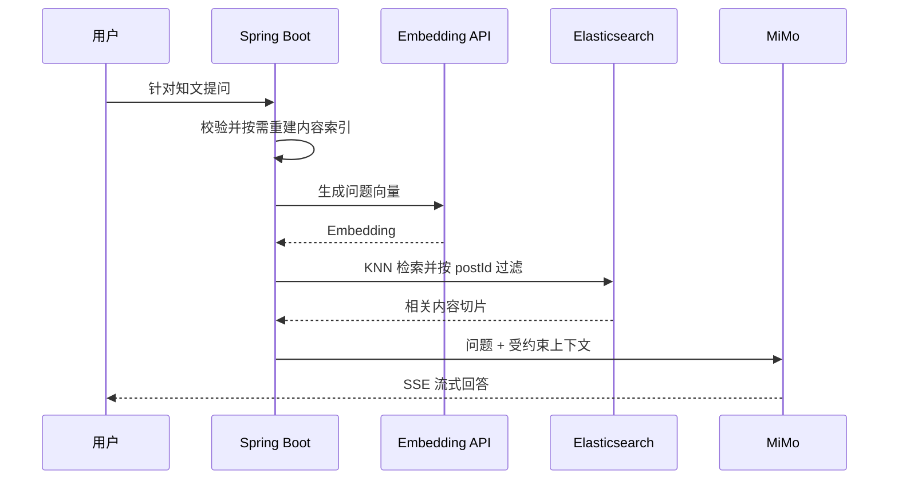

# 智脉（ZhiMai）

> 面向知识创作、内容检索与 AI 辅助学习的全栈知识社区。

`Java 21` · `Spring Boot 3.2` · `React 18` · `TypeScript` · `MySQL` · `Redis` · `Kafka` · `Elasticsearch` · `Spring AI`

智脉围绕“发布一篇知识内容，并让它可以被发现、互动和继续追问”构建完整业务链路。项目不仅实现注册登录、内容发布、Feed、搜索、点赞收藏和关注关系，还针对缓存击穿、异步一致性、全文检索和 RAG 流式问答进行了工程化设计。

## 项目速览

| 维度 | 说明 |
| --- | --- |
| 项目形态 | React + Spring Boot 前后端分离应用 |
| 核心业务 | 用户认证、内容创作、首页 Feed、互动关系、全文搜索、个人主页 |
| AI 能力 | 内容自动摘要、单篇知文 RAG、SSE 流式回答 |
| 工程重点 | 多级缓存、热点 Key 探测、Single Flight、Kafka 异步计数、Transactional Outbox |
| 数据基础设施 | MySQL、Redis、Kafka、Elasticsearch、Canal、阿里云 OSS |

## 为什么做这个项目

普通的内容社区 CRUD 无法覆盖真实后端系统中最常见的难点。智脉选择知识社区作为业务载体，重点实践以下问题：

- 如何设计可刷新、可撤销的无状态身份认证；
- 如何让高频 Feed 请求尽量不回源数据库，并避免缓存击穿和集中失效；
- 如何在关注关系、互动计数和搜索索引之间处理异步一致性；
- 如何把 Markdown 内容切片、向量化、检索并约束大模型基于原文回答；
- 如何让前端完整承接注册、创作、搜索、互动和流式问答流程。

## 系统架构



后端采用模块化单体结构。业务数据以 MySQL 为事实来源，Redis 承担高频读写，Kafka 处理计数和领域事件，Canal 捕获 Outbox 增量，Elasticsearch 同时服务全文搜索与向量检索。

## 核心工程设计

### 1. 可撤销的 JWT 双令牌认证

- 使用 RSA 密钥对签发和校验 JWT，Access Token 与 Refresh Token 职责分离；
- Access Token 默认 15 分钟过期，Refresh Token 默认 7 天过期；
- Refresh Token 的 `jti` 保存在 Redis 白名单，刷新时轮换，退出登录时撤销；
- 密码使用 BCrypt 加密，并对验证码发送频率、有效期和最大尝试次数进行限制。

### 2. 面向 Feed 的多级缓存



- 公共 Feed 使用 Caffeine、Redis 页面缓存和 Redis 片段缓存逐级降压；
- 同一页面并发回源时使用 Single Flight 合并请求，降低缓存击穿风险；
- 缓存 TTL 加入随机抖动，减少大批 Key 同时过期；
- 滑动时间窗口统计 Key 热度，并按热度等级动态延长 TTL；
- 用户维度的点赞、收藏状态不写入公共缓存，避免跨用户数据污染。

### 3. 异步事件与最终一致性

- 点赞、收藏等计数变更写入 Kafka，由消费者异步聚合；
- 关注关系在业务事务内写入 Outbox，避免数据库提交成功但消息发送失败；
- Canal 订阅 Outbox 表并转发 Kafka，消费者更新粉丝关系缓存和搜索索引；
- Kafka Producer 开启幂等配置，Consumer 使用手动确认，降低消息丢失和重复处理风险。

### 4. 单篇内容 RAG



- 发布或更新知文时建立内容向量索引，并通过内容指纹避免无效重建；
- 检索时先扩大召回集合，再按 `postId` 过滤，避免不同文章的上下文互相污染；
- 系统提示词要求模型只依据召回内容作答，无法确定时明确说明；
- 前端使用 `EventSource` 实时展示生成内容，并支持主动终止。

### 5. 搜索与对象存储

- Elasticsearch 提供关键词搜索、标签过滤和搜索建议；
- 搜索索引可由 Outbox 事件增量更新，降低业务写路径耦合；
- 正文、封面和头像通过 OSS 预签名方式直传，后端不转发大文件。

## 功能清单

| 模块 | 已实现能力 |
| --- | --- |
| 认证 | 验证码、注册、登录、Token 刷新、退出登录、密码重置 |
| 内容 | 草稿、正文直传、发布、编辑、可见性、置顶、删除、AI 摘要 |
| Feed | 公共首页、我的发布、分页、详情展示、Markdown 渲染 |
| 互动 | 点赞、收藏、关注、取关、粉丝与关注列表 |
| 搜索 | 关键词检索、标签过滤、联想建议 |
| 用户 | 个人主页、资料编辑、头像上传、关系计数 |
| AI | 单篇知文索引重建、向量召回、RAG 流式问答 |

## 技术栈

| 层级 | 技术 |
| --- | --- |
| 前端 | React 18、TypeScript、Vite 5、React Router、React Markdown |
| 后端 | Java 21、Spring Boot 3.2、Spring Security、Spring AI、MyBatis |
| 数据 | MySQL 8、Redis、Redisson、Caffeine |
| 消息 | Kafka、Canal、Transactional Outbox |
| 搜索与 AI | Elasticsearch、KNN 向量检索、MiMo、DashScope Embedding |
| 存储 | 阿里云 OSS 预签名直传 |
| 测试 | JUnit 5、Mockito、Spring Boot Test、TypeScript 类型检查 |

## 代码导览

如果只想快速了解核心实现，建议按以下顺序阅读：

| 主题 | 入口 |
| --- | --- |
| JWT 与认证流程 | [`backend/src/main/java/com/tongji/auth`](backend/src/main/java/com/tongji/auth) |
| Feed 多级缓存 | [`KnowPostFeedServiceImpl.java`](backend/src/main/java/com/tongji/knowpost/service/impl/KnowPostFeedServiceImpl.java) |
| 热点 Key 探测 | [`HotKeyDetector.java`](backend/src/main/java/com/tongji/cache/hotkey/HotKeyDetector.java) |
| 关注关系与 Outbox | [`backend/src/main/java/com/tongji/relation`](backend/src/main/java/com/tongji/relation) |
| 异步计数 | [`backend/src/main/java/com/tongji/counter`](backend/src/main/java/com/tongji/counter) |
| 全文搜索 | [`backend/src/main/java/com/tongji/search`](backend/src/main/java/com/tongji/search) |
| RAG 索引与问答 | [`backend/src/main/java/com/tongji/llm/rag`](backend/src/main/java/com/tongji/llm/rag) |
| 前端页面 | [`frontend/src/pages`](frontend/src/pages) |
| 数据库结构 | [`backend/db/schema.sql`](backend/db/schema.sql) |

## 项目结构

```text
ZhiMai/
├── frontend/                       # React 前端
│   ├── src/components/             # 通用组件与页面布局
│   ├── src/context/                # 登录状态管理
│   ├── src/pages/                  # 业务页面
│   ├── src/services/               # API 调用层
│   └── public/demo/                # 本地演示正文与封面
├── backend/                        # Spring Boot 后端
│   ├── db/schema.sql               # MySQL 初始化脚本
│   ├── scripts/seed-demo.sql       # 演示数据
│   ├── docs/                       # 接口与设计文档
│   └── src/main/java/com/tongji/   # 后端业务模块
└── README.md
```

## 本地运行

### 环境要求

- JDK 21、Maven 3.9+
- Node.js 18+、npm
- MySQL 8、Redis、Kafka、Elasticsearch
- 可选：Canal、阿里云 OSS、MiMo 与 DashScope API

### 1. 初始化数据库

```bash
mysql -u root -p < backend/db/schema.sql
mysql -u root -p < backend/scripts/seed-demo.sql
```

演示脚本包含 8 个用户、12 篇公开知文和 16 组关注关系，对应的本地 Markdown 正文位于 `frontend/public/demo/`。

### 2. 配置后端

配置项均支持环境变量覆盖，仓库不包含真实凭据。最常用的变量如下：

```dotenv
DB_URL=jdbc:mysql://localhost:3306/zhiguang
DB_USERNAME=root
DB_PASSWORD=your_password
REDIS_HOST=localhost
KAFKA_BOOTSTRAP_SERVERS=localhost:9092
ELASTICSEARCH_URIS=http://localhost:9200

MIMO_API_KEY=your_mimo_key
DASHSCOPE_API_KEY=your_dashscope_key
```

首次运行还需要在 `backend/src/main/resources/keys/` 生成 JWT RSA 密钥，命令见该目录的 [`README.md`](backend/src/main/resources/keys/README.md)。开发环境验证码会写入后端日志，不会真实发送短信或邮件。

### 3. 启动服务

```bash
# 后端，默认 http://localhost:8080
cd backend
mvn spring-boot:run
```

```bash
# 前端，默认 http://localhost:5173
cd frontend
npm ci
npm run dev
```

后端健康检查：`GET http://localhost:8080/actuator/health`

## 测试与构建

```bash
# 前端类型检查与生产构建
cd frontend
npm run lint
npm run build

# 后端测试
cd backend
mvn test
```

当前测试覆盖 JWT 签发与解析、热点 Key 探测等关键逻辑。仓库中的前端类型检查、生产构建和后端测试均可通过。

## 项目边界

该仓库用于完整展示系统设计和核心业务实现。验证码发送器当前采用开发日志输出；真实部署时还需要接入短信或邮件渠道，并补充容器编排、CI/CD、链路追踪和生产级监控告警。
