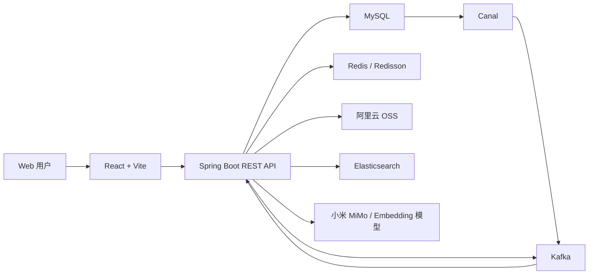

# 智脉（ZhiMai）

智脉是一个面向知识获取与分享场景的前后端分离社区应用。用户可以发布“知文”、浏览首页 Feed、搜索内容、点赞收藏、关注其他用户，并围绕单篇知文进行流式 AI 问答。

项目不仅实现了基础社区功能，也包含缓存、异步消息、搜索、对象存储和 RAG 等服务端实践，适合作为全栈学习、系统设计和二次开发项目。

## 主要功能

- 用户认证：验证码、注册、登录、JWT 双令牌刷新、退出和密码重置
- 知文管理：草稿创建、内容直传、发布、编辑、置顶、可见性设置和删除
- 内容浏览：首页 Feed、知文详情、我的知文和图片预览
- 社区互动：点赞、取消点赞、收藏、取消收藏、关注和取关
- 用户中心：个人资料展示与编辑、头像上传、关注与粉丝列表
- 内容搜索：关键词搜索、标签过滤和搜索建议
- AI 能力：自动生成知文摘要、基于单篇知文的 RAG 流式问答
- 高并发设计：多级缓存、热点探测、single-flight、异步计数和重建机制

## 系统架构



后端采用模块化单体结构。核心模块通过 MySQL 保存业务数据，Redis 承担令牌、缓存和计数等高频访问，Kafka 与 Canal 用于异步事件处理，Elasticsearch 提供全文及向量检索，OSS 保存正文、图片和头像等对象。

## 技术栈

| 范围 | 技术 |
| --- | --- |
| 前端 | React 18、TypeScript、Vite 5、React Router、React Markdown |
| 后端 | Java 21、Spring Boot 3.2、Spring Security、Spring AI、MyBatis |
| 数据与缓存 | MySQL 8、Redis、Redisson、Caffeine |
| 消息与同步 | Kafka、Canal、Transactional Outbox |
| 搜索与 AI | Elasticsearch、RAG、小米 MiMo、OpenAI 兼容 Embedding API |
| 文件存储 | 阿里云 OSS 预签名直传 |
| 测试 | JUnit 5、Mockito、Spring Boot Test、TypeScript 类型检查 |

## 项目结构

仓库整理后采用以下目录结构：

```text
ZhiMai/
├── frontend/                  # React 前端
│   ├── src/
│   │   ├── components/       # 通用组件与页面布局
│   │   ├── context/          # 登录状态管理
│   │   ├── pages/            # 页面与路由
│   │   ├── services/         # 后端 API 调用
│   │   ├── theme/            # 主题变量
│   │   └── types/            # TypeScript 类型
│   └── package.json
├── backend/                   # Spring Boot 后端
│   ├── db/schema.sql          # MySQL 初始化脚本
│   ├── docs/                  # 接口与设计文档
│   ├── src/main/java/com/tongji/
│   │   ├── auth/             # 认证与 JWT
│   │   ├── knowpost/         # 知文与 Feed
│   │   ├── counter/          # 点赞、收藏与计数
│   │   ├── relation/         # 关注关系
│   │   ├── search/           # Elasticsearch 搜索
│   │   ├── llm/              # 摘要与 RAG
│   │   ├── profile/          # 用户资料
│   │   └── storage/          # OSS 上传
│   └── pom.xml
└── README.md
```

## 本地运行

### 1. 环境要求

- JDK 21
- Maven 3.9+
- Node.js 18+ 与 npm
- MySQL 8
- Redis
- Kafka
- Elasticsearch
- 可选：Canal、阿里云 OSS；RAG 功能需要小米 MiMo 与 Embedding 模型服务

若只验证部分功能，可以关闭 Canal 和计数重建，但后端启动及完整业务流程仍依赖相应的数据服务和正确配置。

### 2. 初始化数据库

创建数据库后执行：

```bash
mysql -u root -p < backend/db/schema.sql
```

脚本会创建用户、登录日志、知文、Outbox、关注和粉丝等核心表。

如需快速查看完整页面，可继续导入幂等的演示数据：

```bash
mysql -u root -p < backend/scripts/seed-demo.sql
```

演示数据包含 8 个用户、12 篇公开知文和 16 组关注关系；本地封面与 Markdown 正文位于 `frontend/public/demo/`。导入后重启后端即可清空进程内 Feed 缓存并自动回灌 Elasticsearch。演示账号手机号为 `18800000101` 至 `18800000108`，开发环境登录验证码可从后端日志读取。

### 3. 配置后端

`backend/src/main/resources/application.yml` 已使用环境变量占位，不包含真实凭据。至少设置：

```bash
export MIMO_API_KEY=your_mimo_key
export DASHSCOPE_API_KEY=your_dashscope_key
export DB_PASSWORD=your_mysql_password
```

Windows PowerShell 使用 `$env:MIMO_API_KEY="..."` 的形式。其他主要配置如下：

| 配置前缀 | 用途 |
| --- | --- |
| `spring.datasource` | MySQL 连接信息 |
| `spring.data.redis` | Redis 地址与端口 |
| `spring.kafka` | Kafka Broker 与消费者配置 |
| `spring.elasticsearch` | Elasticsearch 地址 |
| `spring.ai.deepseek` | 小米 MiMo OpenAI 兼容接口配置（沿用 Spring AI 配置前缀） |
| `spring.ai.openai` | Embedding 模型配置 |
| `spring.ai.vectorstore.elasticsearch` | 向量索引名称与维度 |
| `canal` | MySQL Binlog 订阅；本地无需时可设置 `enabled: false` |
| `oss` | OSS Endpoint、Bucket 与访问凭据 |
| `auth.jwt` | JWT 签名密钥路径与令牌有效期 |

向量模型的输出维度必须与 `spring.ai.vectorstore.elasticsearch.dimensions` 保持一致。

首次运行还需在 `backend/src/main/resources/keys/` 生成 JWT 开发密钥，命令见该目录的 `README.md`。密钥文件和 `application-local.yml` 均已被 Git 忽略。

开发环境中的验证码发送器只会把验证码写入后端日志，不会实际发送短信或邮件。

### 4. 启动后端

```bash
cd backend
mvn spring-boot:run
```

后端默认运行在 `http://localhost:8080`，健康检查地址为：

```text
http://localhost:8080/actuator/health
```

### 5. 启动前端

```bash
cd frontend
npm ci
npm run dev
```

访问 `http://localhost:5173`。开发服务器会把 `/api` 请求代理到 `http://localhost:8080`。

生产环境可通过前端环境变量指定 API 地址：

```dotenv
VITE_API_BASE_URL=https://api.example.com
```

## 页面路由

| 路径 | 页面 |
| --- | --- |
| `/` | 首页 Feed |
| `/search` | 内容搜索 |
| `/create` | 发布知文 |
| `/learn` | 学习页 |
| `/post/:id` | 知文详情与 AI 问答 |
| `/profile` | 个人主页 |
| `/profile/edit` | 编辑资料 |
| `/login` | 登录 |
| `/register` | 注册 |

## API 概览

后端接口统一使用 `/api/v1` 前缀：

| 模块 | 前缀 | 说明 |
| --- | --- | --- |
| 认证 | `/api/v1/auth` | 验证码、注册、登录、令牌刷新、退出 |
| 知文 | `/api/v1/knowposts` | 草稿、发布、Feed、详情、摘要和 RAG |
| 文件 | `/api/v1/storage` | OSS 预签名上传 |
| 互动 | `/api/v1/action` | 点赞、收藏及其撤销操作 |
| 计数 | `/api/v1/counter` | 点赞数、收藏数等聚合计数 |
| 关系 | `/api/v1/relation` | 关注、取关、粉丝和关注列表 |
| 资料 | `/api/v1/profile` | 用户资料与头像 |
| 搜索 | `/api/v1/search` | 内容搜索与关键词建议 |

详细请求和响应格式见 `backend/docs/` 与 `frontend/docs/`。

## 检查与测试

前端：

```bash
cd frontend
npm run lint
npm run build
```

后端：

```bash
cd backend
mvn test
```

现有后端测试主要覆盖 JWT 服务与热点 Key 探测逻辑。

## 安全提示

- 不要把数据库密码、模型 API Key、OSS 密钥或 JWT 私钥提交到 Git。
- 建议使用环境变量或本地配置文件注入敏感配置，并提供脱敏的示例配置。
- 生产环境应限制 CORS 来源，关闭验证码日志输出，并接入真实验证码发送渠道。
- 上线前应为 MySQL、Redis、Kafka、Elasticsearch 和 Canal 启用认证及网络访问控制。

## 当前状态

项目已具备前后端主要业务链路和配套设计文档，但仍属于开发阶段。生产部署前建议补充集成测试、容器化编排、配置分环境管理、可观测性和自动化 CI。
